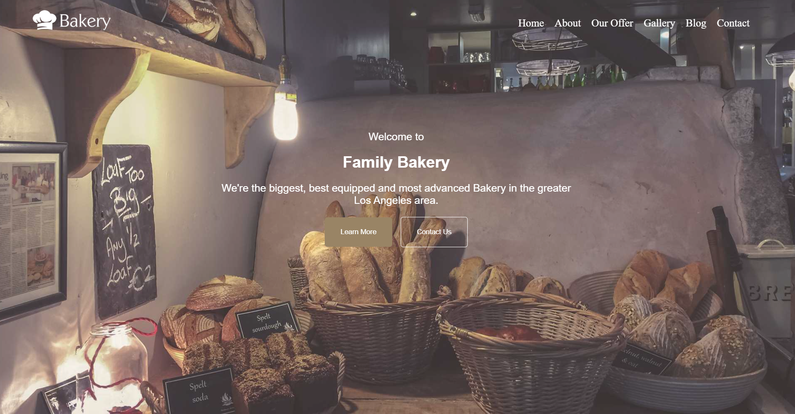
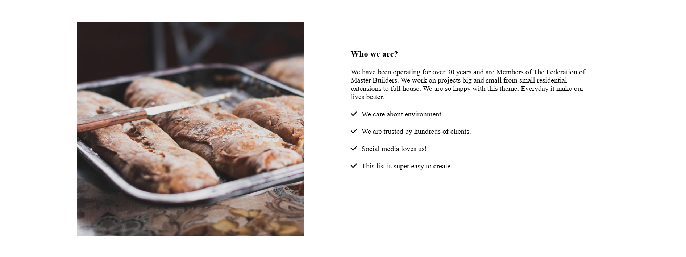
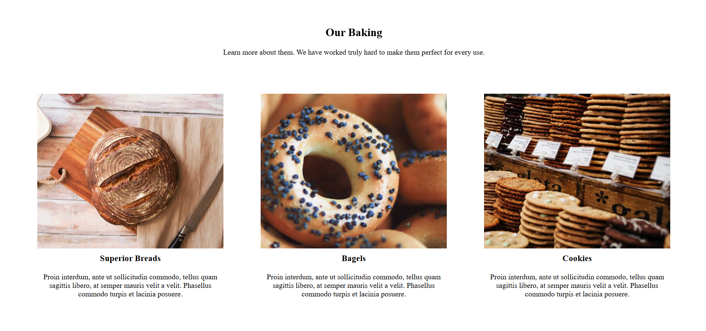
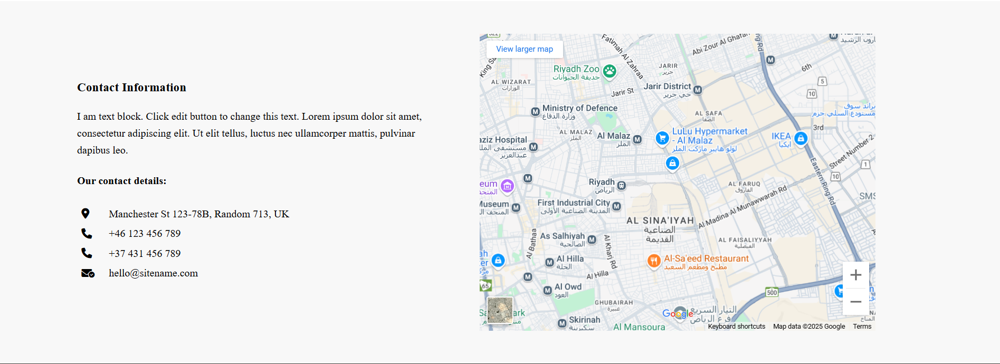
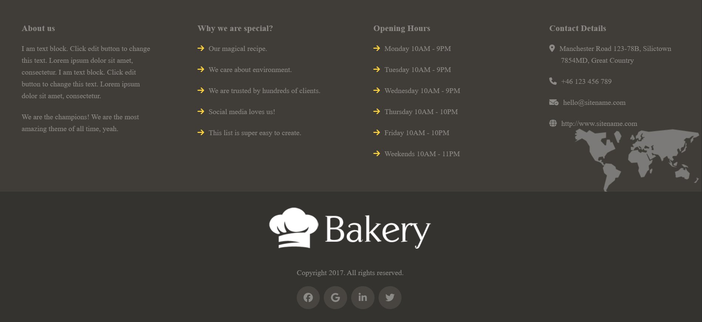

# Bekary Website 🥐

This is a basic static website for a bakery, built as a front-end practice project using only HTML and CSS.

## 🔧 Technologies Used

- HTML5
- CSS3
- Float & Inline-block
- Box Model

## 📸 Preview

## [Project Screenshot]

.
.
.
.
.
.

## 🌐 Live Demo

👉 [Click here to view the project live](https://YourLiveLinkHere.com)

## 📁 Features

- Homepage with hero section, services, gallery, and contact.
- Static layout.
- Clean design with visual hierarchy.
- Well-structured code for learning purposes.

## 🚀 Future Improvements

- Make it responsive using Flexbox & Media Queries.
- Improve accessibility and semantic structure.
- Add form validation and interactivity with JavaScript.

## 📦 How to Run Locally

1. Clone the repo:

```bash
git clone https://github.com/yourusername/bekary-website.git
```
